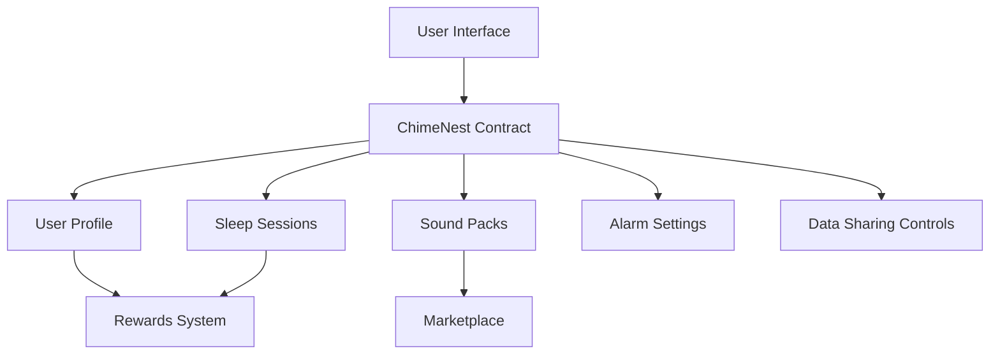

# ChimeNest Sleep Tracker

A comprehensive sleep management platform built on the Stacks blockchain that combines sleep tracking, white noise generation, and smart alarms to help users optimize their sleep cycles.

## Overview

ChimeNest is a decentralized sleep management solution that empowers users to:
- Track and store sleep data securely on-chain
- Access premium sound packs for better sleep
- Set customizable smart alarms with flexible wake windows
- Earn rewards for maintaining healthy sleep habits
- Optionally share sleep data for research purposes

The platform prioritizes user privacy while providing incentives for consistent sleep patterns and offering a marketplace for premium sleep-enhancing sound content.

## Architecture



The smart contract implements several key components:
- User profile management
- Encrypted sleep session tracking
- Sound pack marketplace
- Customizable alarm system
- Reward distribution mechanism
- Privacy-focused data sharing controls

## Contract Documentation

### Core Components

#### User Management
- User registration and profile tracking
- Privacy settings management
- Reward balance tracking

#### Sleep Sessions
- Secure storage of sleep metrics
- Encrypted data management
- Quality scoring system

#### Sound Packs
- Marketplace for premium sound content
- Supply management
- Ownership tracking

#### Smart Alarms
- Customizable wake windows
- Day-specific settings
- Sound pack integration

## Getting Started

### Prerequisites
- Clarinet
- Stacks wallet
- Node.js environment

### Installation

1. Clone the repository
2. Install dependencies:
```bash
clarinet install
```

### Basic Usage

1. Register a new user:
```clarity
(contract-call? .chimenest register-user)
```

2. Record a sleep session:
```clarity
(contract-call? .chimenest record-sleep-session u1234567890 u1234599999 u85 "encrypted-data")
```

3. Purchase a sound pack:
```clarity
(contract-call? .chimenest purchase-sound-pack u1)
```

## Function Reference

### User Management

`register-user()`
- Registers a new user on the platform
- Returns: (response bool)

`set-data-sharing(enabled: bool)`
- Opts in/out of data sharing
- Returns: (response bool)

### Sleep Tracking

`record-sleep-session(start-time: uint, end-time: uint, quality-score: uint, encrypted-metrics: string-utf8)`
- Records a new sleep session
- Returns: (response uint)

`claim-sleep-reward(session-id: uint)`
- Claims rewards for a completed sleep session
- Returns: (response uint)

### Sound Pack Management

`create-sound-pack(name: string-utf8, description: string-utf8, price: uint, total-supply: uint)`
- Creates a new sound pack (admin only)
- Returns: (response uint)

`purchase-sound-pack(sound-pack-id: uint)`
- Purchases a sound pack using earned rewards
- Returns: (response bool)

### Alarm Management

`set-alarm(alarm-id: uint, sound-pack-id: uint, scheduled-time: uint, window-before: uint, window-after: uint, days-active: (list 7 bool))`
- Creates or updates an alarm setting
- Returns: (response bool)

`toggle-alarm(alarm-id: uint, enabled: bool)`
- Enables or disables an existing alarm
- Returns: (response bool)

## Development

### Testing
Run the test suite:
```bash
clarinet test
```

### Local Development
1. Start Clarinet console:
```bash
clarinet console
```

2. Deploy contracts:
```bash
clarinet deploy
```

## Security Considerations

### Data Privacy
- Sleep data is stored in encrypted format
- Only the user has access to their unencrypted data
- Data sharing is opt-in only

### Access Control
- Admin functions are protected
- Sound pack purchases require ownership verification
- Reward claims have double-spend protection

### Limitations
- Time-based functions rely on block height
- Reward calculations are deterministic
- Sound pack supply is finite